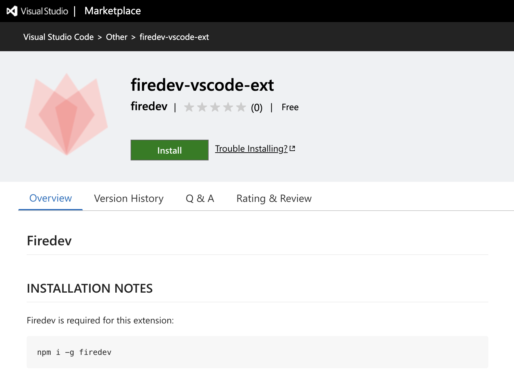
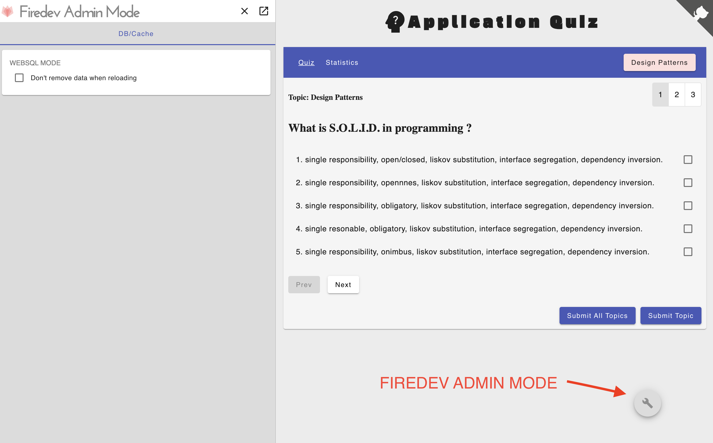
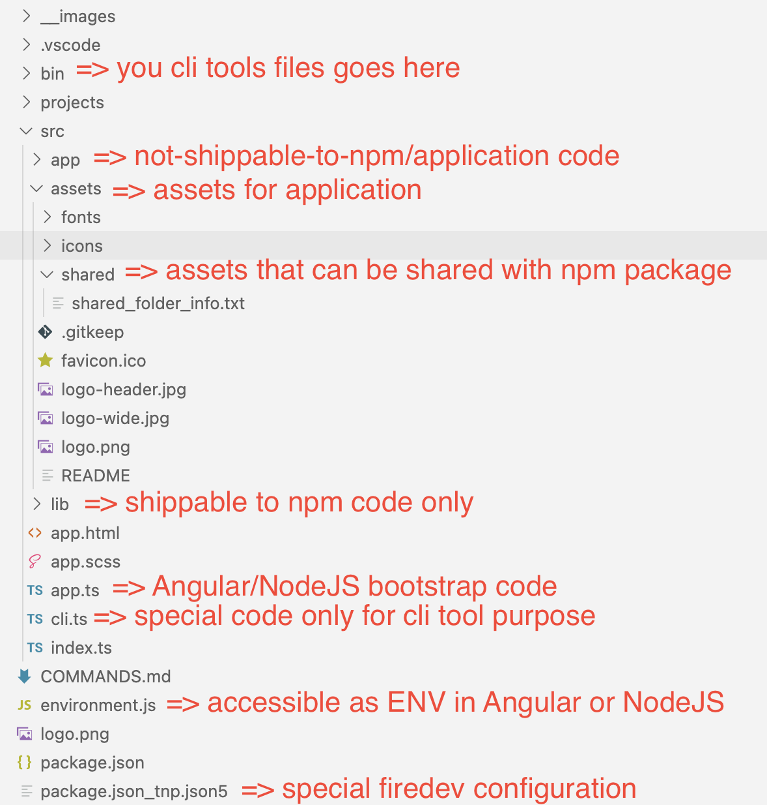
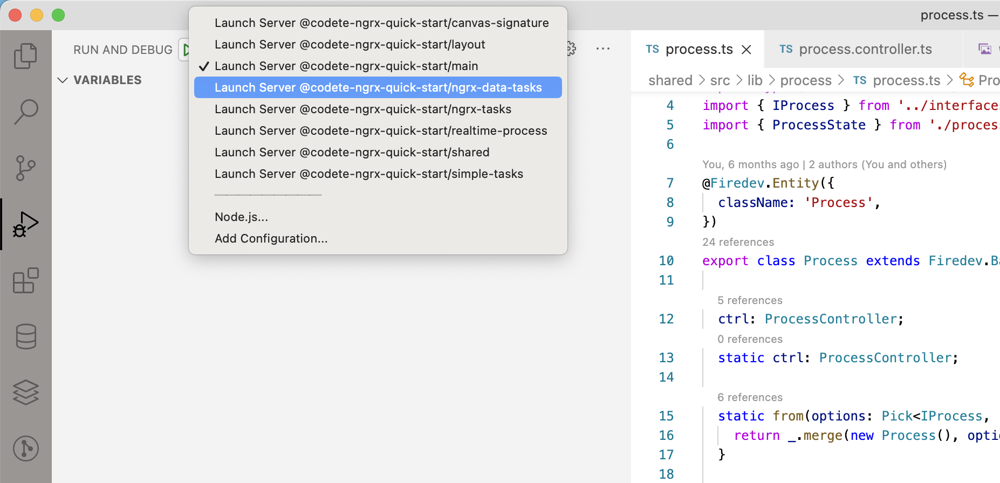

<p style="text-align: center;"></p>

( BETA VERSION )

**Firedev** 🔥🔥🔥 is a solution for

\+
[typescript](https://www.typescriptlang.org/)  

\+
[angular](https://angular.io/) 

\+
[rxjs](https://rxjs.dev/)  / [ngrx](https://ngrx.io/) (optional) 

\+
[nodejs](https://nodejs.org/en/)

\+ [typeorm](https://typeorm.io/)
- [sqlite](https://github.com/WiseLibs/better-sqlite3) - SUPPORTED
- [sql.js](https://sql.js.org) - SUPPORTED IN WEBSQL MODE
- [mysql](https://www.mysql.com/) - support in progress
- [postgress](https://www.postgresql.org) - support in progress
- [mongo](https://www.postgresql.org) - support in progress


backend/frontend [*isomorphic](https://en.wikipedia.org/wiki/Isomorphic_JavaScript)  apps .


# Required version of NodeJS 
- Windows 10/11 (gitbash): >= v16 
- MacOS: >= v16
- Linux: >= v16

(lower versions of nodejs are unofficialy 
support for MacOS/Linux)
# How to install firedev
```
npm i -g firedev
```

# How to install firedev Visual Studio Code extension
Go to: https://marketplace.visualstudio.com/items?itemName=firedev.firedev-vscode-ext

<p style="text-align: center;border: 1px solid black;"></p>

#  How to uninstall firedev from local machine
Firedev stores a big global container (in ~/.firedev) for npm packages that are being shared 
accros all firedev apps
```
npm uninstall -g firedev
rm -rf ~/.firedev  # firedev local packages repository
```

# Philosophy of Firedev
=> One language for browser/backend/database - **TypeScript**

=> Builded on top of rock solid frameworks

=> **Never** ever **repeat** single line of **code**

=> Everything automatically generated, strongly typed

=> Crazy fast / developer-friendly coding in <b>Visual Studio Code</b>

=> Shared <b>node_modules</b> for similar projects (from one big npm pacakges container)

=>**No need for local node_modules** => many projects takes magabytes instead gigabytes

=> Automation for releasing projects (standalone and organization) to github pages / npm repositories (github actions, dockers support comming soon)

=> Develop libraries and apps at the same time! (mixed NodeJs packages with proper Angular ivy packages)

=> Assets from projects can be shared with npm!

=> Two development modes
  1. NORMAL - sqlite/mysql for database and normal NodeJS server
  2. WEBSQL - sql.js for database and server mock in browser (perfect for github pages, e2e and more!)


# Advantages of Firedev
## 1. No separation between backend and frontend code (use BE entity as FE dto!) .
- this is a dream situation for any developer!
- perfect solution for any kind of projects ( hobbyst / freelancers / enterprise )
- CRAZY FAST business changes across database table and frontend 
anduglar templates - CHECK!
- code/database refactor at the same time!

<b>example.ts</b>

```ts
import { Firedev } from 'firedev';

@Firedev.Entity()
class User {
  //#region @backend
  @Firedev.Orm.Column.Generated()
  //#endregion
  id: string;
}

```

your browser will get code below:
```ts
import { Firedev } from 'firedev/browser';

@Firedev.Entity()
class User {
  /* */
  /* */
  /* */
  id: string;
}

```

## 2. Additional "Websql Mode" for writing backend in browser!
- Instead running local server - run everything (db,backend) in browser thanks to sql.js/typeorm !
- This is possible ONLY in firedev with highest possible abstraction concepts

<b>example.ts</b>

```ts
import { Firedev } from 'firedev';

@Firedev.Entity()
class User {
  //#region @websql
  @Firedev.Orm.Column.Generated()
  //#endregion
  id: string;
}

```

your browser will get code below:
```ts
import { Firedev } from 'firedev/websql';


@Firedev.Entity()
class User {
 //#region @websql
  @Firedev.Orm.Column.Generated()
  //#endregion
  id: string;
}

```
Database columns are created on frontend (with sql.js) !

<p style="text-align: center;"></p>
 Plus also you can set in *Firedev Admin Mode* if you prefere to 
 clear database after each page refresh.


## 3. Smooth REST api - define host only  once and nothing else!
- no more of ugly acces to server... firedev takes it to next level !
- in Angular/RxJS environemtn => it more than pefect solution !

user.controller.ts
```ts
@Firedev.Controller({
  entity: User
})
class UserController {
                      
                      // name 'helloAmazingWorld' 
                      // from this class function 
                      // is being use for creating
  @Firedev.Http.GET() // expressjs server routes 
  helloAmazingWorld():Firedev.Response<string> {  
    //region @backendFunc
    return async () => {
      return `hello world`;
    };
    //#endregion
  }

}
```

user.ts
```ts
@Firedev.Entity()
class User {
  static ctrl: UserController; // automatically injected
  static helloAmazingWorld() {
    return this.ctrl.helloAmazingWorld().received.observable;
  } 
}
```

user.component.ts
```ts
@Component({
  selector: 'app-user',
  template: `
  Message from user:  {{ userHello$ | async }}  
  `
  ...
})
export class UserComponent implements OnInit {
   userHello$ = User.helloAmazingWorld();
   ...
}
```


app.module.ts
```ts
const host = 'http://localhost:4444'; // host defined once!

const context = await Firedev.init({
    host,
    controllers: [UserController],
    entities: [User],
    //#region @backend
    config // for database configuration
    //#endregion
    ...
  });

context.host // -> available on backend and frontend !


```
## 4. CRUD api in 60 seconds or less...
- use observable or promises .. .whater you like
```ts
@Firedev.Entity()
class Task {
  //#region @backend
  @Firedev.Orm.Column.Generated()
  //#endregion
  id: number;
}

@Firedev.Controlle({ entity: Task })
export class TaskController extends Firedev.Base.Controller<Task>{ } 

@Component({
  // ...
})
export class TasksComponent implements OnInit {
   constructor( tasksController: TaskController ) {  }

  // .getAll(), getBy(), deleteById(), \ById() etc.
  tasks$ = this.tasksController.getAll().received.observable.pipe(
    map( response => response.body.json )
  );
}

```

## 5. Super easy realtime / sockets communication
- realtime communication as simple as possible!
task.ts
```ts
@Firedev.Entity()
class Task {
  static ctrl: TaskController; // automatically injected
  //#region @backend
  @Firedev.Orm.Column.Generated()
  //#endregion
  id: number;
}
```
task.controller.ts
 ```ts
@Firedev.Controlle({ entity: Task })
export class TaskController extends Firedev.Base.Controller<Task>{ } 
```
task.component.ts
```ts
@Component({
  ...
})
export class TasksComponent implements OnInit, OnDestroy { 
  $destroyed = new Subject();

  @Input(); task: Task;
  ngOnInit() {
    Firedev.Realtime.Browser.listenChangesEntityObj(this.task).pipe(
      takeUntil(this.$destroyed)
      exhaustMap(()=> {
        return Tasks.ctrl.getBy(this.task.id).received.observable.pipe(
          map( response => {
            this.task = response.body.json;
          })
        )
      })
    );
  }

  ngOnDestroy() { // it will automatically unsubscribe from socket communication
    this.$destroyed.next();
    this.$destroyed.unsubscribe();
  }

}
 ```

# Firedev commands
1. Create new standalone app (simple project, cli tools)
that can be relaased in npm as organization normal packages
(example **my-standalone-app**)
```
firedev new my-standalone-app
```
2. Create new organization app (for complex projects)
that can be released in npm as organization packages 
(example **@organization/app**)
```
firedev new organization/app 
```

3. Release app to github pages or/and npm
```
firedev release

firedev ar # quick patch release of lib to npm 
firedev adr # quick release of app to github with last configuration
```

4. Update firedev from npm and local container from npm packages
```
firedev au  #  auto:update
```

# Standalone project structure
- *Organization project container* has many "small" **standalone projects** inside itself.
- Standalone projects can be also use as global cli terminal tools

<p style="text-align: center;"></p>


# QA
## 1. How to create/start single project 
- best for opensource/smaller projects
- can be deployed to github pages
- can be deployed to npm as organization package
```
firedev new my-app
cd my-app
firedev start
# select proper debug task in  Visual Studio Code
# press f5 in your Visual Studio Code
```

## 2 How to create/start organization project
- best private/complex application
- can be deployed to github pages
- can be deployed to npm as organization package
```
firedev new my-workspace-with-apps/app
cd new my-workspace-with-apps
firedev start
# select proper debug task in  Visual Studio Code
# press f5 in your Visual Studio Code
```
<p style="text-align: center;"></p>

## 3 How to start project in WEBSQL MODE ?
```
firedev new my-organization-or-standalone-app
cd new my-organization-or-standalone-app
firedev start --websql
```


# What is in progress
- support for auto-generated typeorm query selector
- support for typeorm auto migrations
- support for github actions
- support for mysql/postgress/docker

